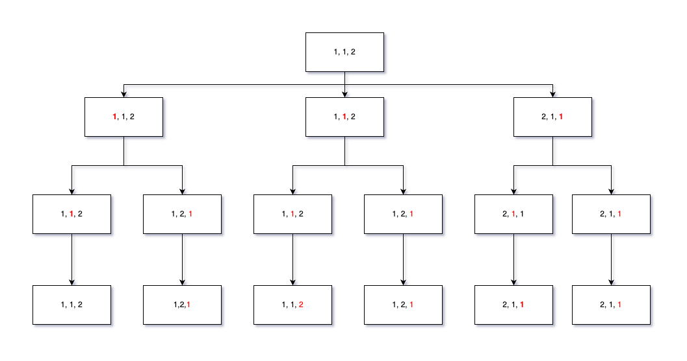
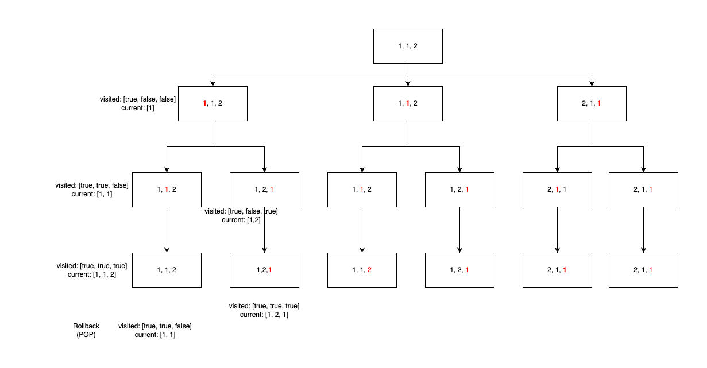
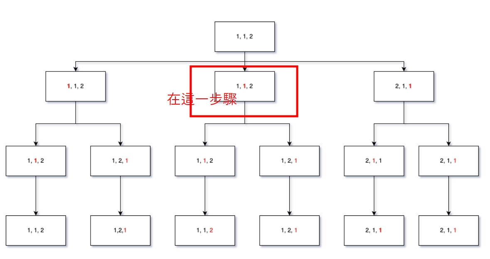

# 47. Permutations II

<br>

---

<br>


https://leetcode.com/problems/permutations-ii/description/


<br>

## Topic

* Array
* Backtracking
* Sorting

<br>

---

<br>

## Brain Strom

<br>

Extention permutations problem, we got duplicates in input nums.

I think it basically same as permutations (simply using backtracking), but we have to figure out how to reduce duplicate result.

There are many way to do that, like remove duplicate result after all backtracking calculation. But I think it not the best efficient approach.

The Topic give us a hint about __sort__, then what does sort do in this case？

<br>

When we sort the `nums` in first place, we can make all duplicate numbers group together (I mean they are adjacent). This "group" allow us easily detect when we gonna use duplicate number in the same "decision level" in our backtracking recursion.

let's try to sort `nums` and figure out when should we skip backtracking decision level. 

<br>



<br>

solution:

<br>



<br>

```rust
impl Solution {

    pub fn permute_unique(nums: Vec<i32>) -> Vec<Vec<i32>> {
        // create a result vector.
        let mut results: Vec<Vec<i32>> = vec![];
        let mut nums = nums;
        let mut used: Vec<bool> = vec![false; nums.len()];
        let mut current: Vec<i32> = vec![];

        // sort nums in first place
        nums.sort();
        
        // call the backtracking function.
        Self::_backtracking(&mut results, &nums, &mut current, &mut used);

        results
    }

    fn _backtracking(results: &mut Vec<Vec<i32>>, nums: &Vec<i32>, current: &mut Vec<i32>, visited: &mut Vec<bool>) {
        if current.len() == nums.len() {
            results.push(current.clone());
            return;
        }

        for i in 0..nums.len() {
            // 1. skip the visited numbers.
            if visited[i] {
                continue;
            }

            // !!! IMPORTANT !!!
            // Skip duplicates: if the current number is the same as the previous one
            // and the previous one is not used in this permutation branch (already put into result in previous step).
            if i > 0 && nums[i] == nums[i-1] && !visited[i-1] {
                continue;
            }
            
            // 2. put the current number into the current vector.
            current.push(nums[i]);
            visited[i] = true;
            
            // 3. go to the next level.
            Self::_backtracking(results, nums, current, visited);

            // 4. rollback the current number.
            current.pop();
            visited[i] = false;
        }

    }
}
```

<br>

---

<br>

## 補充:


有點難，下面用中文復盤一下:

首先，不同於我在 Permutations I 版本中使用 SWAP 的方式實作 backtracking。在這裡需要使用另一種方法。大致上過程如下。

舉例 `nums[1, 2, 3]`:

在 backtracking 第一層中有 3 個分支，我們分別要選擇 1, 2, 3 來當結果的頭部。

```
<Layer-1: Branch-1> :

current: [1, ?, ?]
visited: [O, X, X]
```

當我們選擇 nums 中第一元素當作頭部實，標記 nums[1] 為已使用過，接下來移動到下一層:

```
<Layer-1: Branch-1> -> <Layer-2: Branch-1> :

current: [1, 2, ?]
visited: [O, O, X]
```

我們繼續選擇了 nums 第二個元素當作結果的第二個，同時標記 nums[2] 已使用，接著到下一層:

```
<Layer-1: Branch-1> -> <Layer-2: Branch-1> > <Layer-3: Branch-1> :

current: [1, 2, 3]
visited: [O, O, O]
```

同以上，我們現在得到第一組答案 `[1, 2, 3]`，隨後直接 return 回到上一層。
當返回上一層之後 (`<Layer-1: Branch-1> -> <Layer-2: Branch-1>`)，還需要做 rollback 才能進入到下一個分支去，所以我們先做一次 rollback:

```
<Layer-1: Branch-1> -> <Layer-2: Branch-1> :

rollback:

current: [1, ?, ?]
visited: [O, X, X]
```

然後我們進入 Layer-2 的下一個分支:

```
<Layer-1: Branch-1> -> <Layer-2: Branch-2> :

rollback:

current: [1, 3, ?]
visited: [O, X, O]
```

我們在這一個分支裡使用 nums[3] 作為第二個元素。注意此時的 `visited[]` 第三個元素已經被標記為 __已使用__。

進入下一層:

```
<Layer-1: Branch-1> -> <Layer-2: Branch-2> > <Layer-3: Branch-1> :

current: [1, 3, 2]
visited: [O, O, O]
```

我們又得到了一個結果 `[1, 3, 2]`。然後就是一路 rollback 回去重做。

<br>

以上是我們處理不重複的數組的過程。

<br>
<br>

### 如果我們需要面對可能重複的元素，並做到去重複該怎麼做 ?

<br>

基於上面的計算過程，我們只需要先確保 `nums[]` 先被排過順序，不管升降序都可以。

舉例 `nums[1, 1, 2]`:

我們需要做到在可能出現重複結果時，直接止損跳過計算，進入下一個 Branch。

__那麼時麼時候我們可以跳過 ?__

當我們選定準備要 PUSH 到結果中的 __`nums[i]` 數字，與前一個 `nums[i-1]` 相等時__，且 __前一個 `nums[i-1]` 沒有被選過時__ 就要跳過。

<br>

### 我們一段一段的細品這句話:

* __`nums[i]` 數字，與前一個 `nums[i-1]` 相等時__:

    `[1, 1, 2]` 裡面前兩個數字都是 1，達成了這一個條件，但是我們可以直接跳過嗎 ? 當然不行，你至少要有一組開頭是 `[1, 1, ?]` 這樣的答案吧 ! 所以我們看條件二。

<br>

* __前一個 `nums[i-1]` 沒有被選過__:

    我們使用 `visited[]` 陣列來標記 `nums[]` 中那些已被使用過的元素。__什麼時候 `nums[i-1]` 會是未使用而 `nums[i]` 卻已被使用呢?

    來看圖:

    

    <br>

    在 `<Layer-1 - Branch-2>` 中。我們當前選 `nums[2]` 當作第一個元素結果: 
    
    ```
    current: [1, ?, ?]
    visited: [X, O, X]

    ```
    __重點來了，i = 1, nums[i] = nums[i-1]，已達成條件 1，同時 nums[i-1] (visited[0]) 也未被使用 !__

    那就代表我們可以跳過這一個 branch 了，因為甚麼呢 ? __因為既然 visited[0] 沒有被選過，那代表在之前的 Branch 中已經完成過了 [1, 1, ?] 的向下分層探索__，重做一次分層分枝是沒有意義的行為。


    既:

    ```
    // 在之前的 Branch 中已經完成過向下分層探索了，可以直接跳過。
    if i > 0 && nums[i] == nums[i-1] && !visited[i-1] {
        continue;
    }
    ``` 
