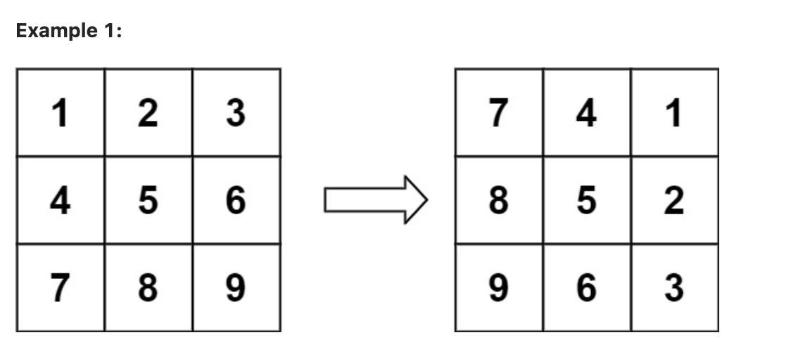
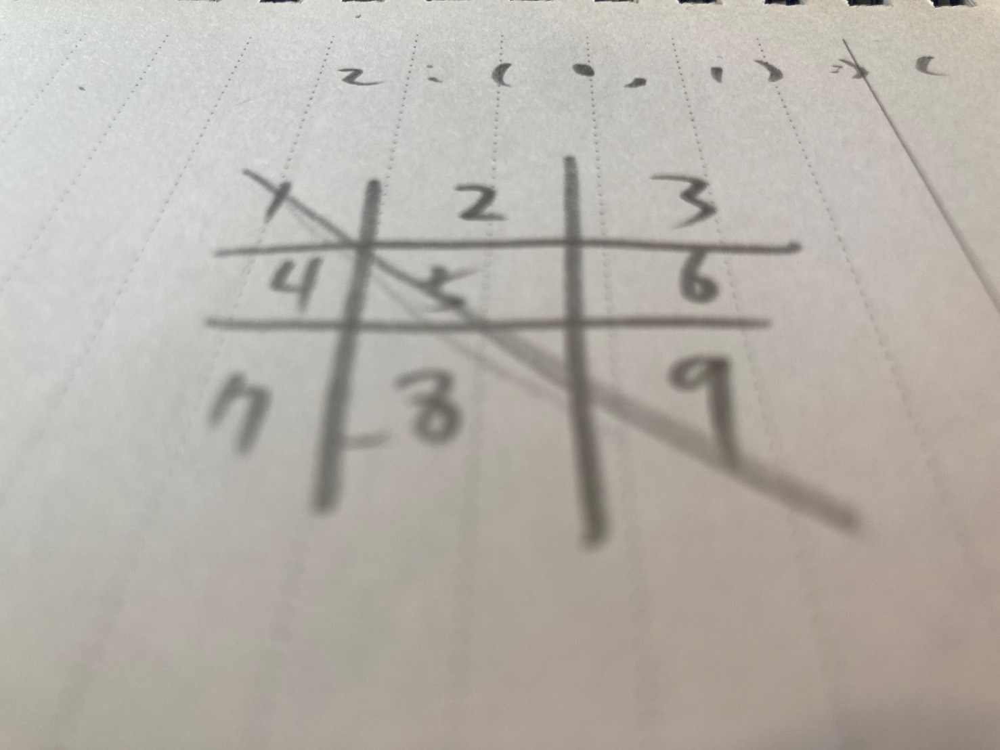

# 48. Rotate Image

<br>

---

<br>

https://leetcode.com/problems/rotate-image/description/

<br>

## Topic

* Array
* Math
* Matrix

<br>

---

<br>

## Brain Strom

<br>

### Induction



let's see how the element move:

| Element |  From (row, col) | To (row, col)  |
|:---:|:---:|:---:|
| 1 | (0, 0) | (0, 2) |
| 2 | (0, 1) | (1, 2) |
| 3 | (0, 2) | (2, 2) |
| 4 | (1, 0) | (0, 1) |
| 5 | (1, 1) | (1, 1) |
| 6 | (1, 2) | (2, 1) |
| 7 | (3, 0) | (0, 0) |
| 8 | (3, 1) | (1, 0) |
| 9 | (3, 2) | (2, 0) |

<br>

As the above we saw, we can infer the movement regulation formula.

```
n = Square side length (in this case n = 3)

Matrix(row, col) -- Rotate Transfer -> Matrix(col, n-1-row) 
```

If we ignore the rule: __DO NOT allocate another 2D matrix and do the rotation.__ what we can do?

define a new 2D array, and iterate through the input 2D array, put element into new 2D array by transfer formula.

Like:

* do loop
* find original element 1 in position [0, 0]
* calculate new position lelement 1 to [0, 2]
* put 1 into new2DArr[0, 2]
* next loop

<br>

But when it come with __in place__ rule, we can't do it like this. So what we can do?

<br>

### Flip horizontally & Flip diagonally.

<br>

What if we do do this 2D array with __Flip horizontally__ ?

let's check it out:


```
---------
1 | 2 | 3
---------
4 | 5 | 6
---------
7 | 8 | 9

> Flip horizontally:

---------
7 | 8 | 9
---------
4 | 5 | 6
---------
1 | 2 | 3
```

The flip horizontally formula is:

```
Matrix (row, col) -> Matrx (n-1-row, col)
```

<br>


What if we do do this 2D array with __Flip diagonally__ ?



```
---------
1 | 2 | 3
---------
4 | 5 | 6
---------
7 | 8 | 9

Flip diagonally:

---------
1 | 4 | 7
---------
2 | 5 | 8
---------
3 | 6 | 9

```


The filp diagonally formula is:

```
Matrix (row, col) -> Matrx (col, row)
```

<br>

Now we zoom out, let check those three formula:

```
# 90 degree rotate:

Matrix(col, n-1-row) 

---------------------------------

# Flip horizontally:

Matrx(n-1-row, col)

---------------------------------

# Flip diagonally

Matrx(col, row)

---------------------------------
```

<br>

__90 degree rotate is actually equals to Flip horizontally + Flip diagonally !__

```
Matrix(col, n-1-row) = Matrx(n-1-row, col) + Matrx(col, row)
```

<br>

__The solution is do 1 time flip hirizontally then do 1 time flip diagonally too.__

<br>
<br>

---

```rust
impl Solution {
    pub fn rotate(matrix: &mut Vec<Vec<i32>>) {
        //TODO
    }
}
```

