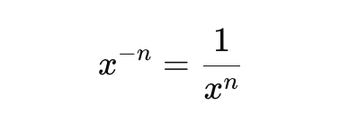

# 050 Pow(x, n)

<br>

---

<br>

https://leetcode.com/problems/powx-n/description/

<br>

## Topic

* Math
* Recursion

<br>


## Brain Strom

`Pow(x, n)` is quite easy to implement.

* if perfect power `n` is positive then loop n time and accumulate the `x*x` result. 
* if perfect power `n` is negative then loop `abs(n)` time and accumulate the `reciprocal(x)*x` result.

But I guess there must have some binary math tricky approach to solve this problem.

<br>

### Fast Power

Exponentiation by squaring trick that runs in `O(log n)` instead of `O(n)`. The idea is:

1. Handle the sign of `n`:

    If n is negative, compute:
    

    so we can work with a non‐negative exponent and take the reciprocal at the end.

<br>

2. Binary‐decompose the exponent:

    Think of `n` in binary. Every time you "halve" `n`, you square `x`. Whenever there's a 1‐bit in `n`, you multiply the running result by the current `x`.

<br>

3. Loop / recurse in `O(log n)` steps

    ```
    result = 1
    while n > 0:
    if n & 1 == 1:
        result *= x
    x *= x
    n >>= 1
    return result
    ```

<br>
<br>

Tutorial in Bilibli: [link](https://www.bilibili.com/video/BV1P3411j72h/?spm_id_from=333.337.search-card.all.click&vd_source=9780a181ac9f1fee5f680f255ee5bc73)

<br>
<br>

## Code

```rust 
impl Solution {
    pub fn my_pow(x: f64, n: i32) -> f64 {
        
    }
}
```