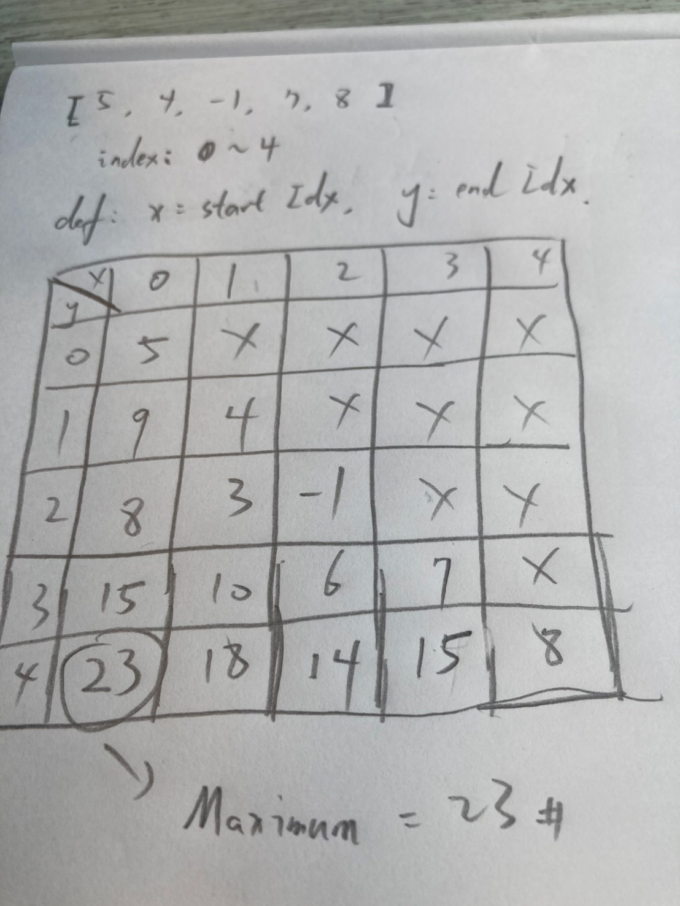
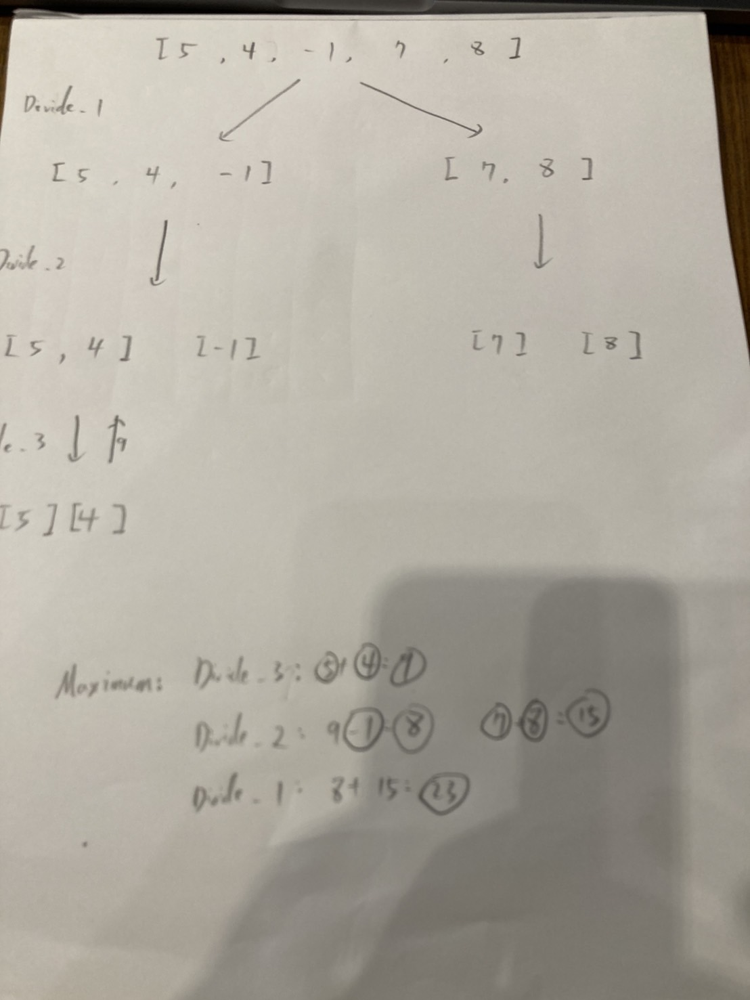
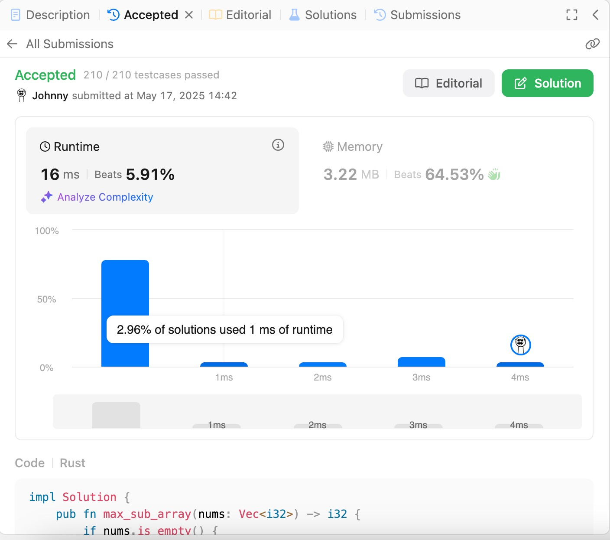

# 53. Maximum Subarray

<br>

link: https://leetcode.com/problems/maximum-subarray/description/

<br>

---

## Topic

* Array
* Divide and Conquer
* Dynamic Programming

<br>

## Brain Strom

<br>

The Topic say __DP__ and __Divide and Conquer__.

Let's put Divide and Conquer behind, I think it's another approach, maybe leave it to next week challange.

Now, let's focus on DP.

What is DP? Exchange space for time. define a array, maybe 2D. and put partial result into it.

<br>

We have a question here, how do we define DP? let's try it with some paper work.

<br>



<br>

I give this hand writting DP solution to Chat-GPT and I got some advice:

<br>
<br>

### Chat-GPT Advice

All you really need is a 1D DP:

Let `dp[i]` = maximum subarray ending at index i.

Recurrence:

```
dp[0] = nums[0]
dp[i] = max(dp[i-1] + nums[i], nums[i])
Then the answer is max(dp[i]) over all i.
```

<br>
<br>

## Let's coding

```rust
impl Solution {
    pub fn max_sub_array(nums: Vec<i32>) -> i32 {
        // Define a DP array to store the maximum sum of subarrays ending at each index
        let mut dp = vec![0; nums.len()];
        let mut max_num_result = nums[0];

        // Init dp[0] with the first element of nums
        dp[0] = nums[0];

        // Iterate through the nums array starting from index 1
        for i in 1..nums.len() {
            dp[i] = Self::max(nums[i], dp[i - 1] + nums[i]);
            max_num_result = Self::max(max_num_result, dp[i]);
        }

        max_num_result
    }

    fn max(a: i32, b: i32) -> i32 {
        if a > b {
            a
        } else {
            b
        }
    }
}
```

<br>


<br>
<br>

Hell yeah! let's do it with Divide and Conquer approach next week.

<br>

---

<br>
<br>

## Another Approach - Divide and Conquer

<br>

### Brain Strom

First of all, I have to say I never try Divide and Conquer approach to solve any algorithm problem before.
I need ask Chat-GPT to understand how to deconstruct the problem in D&C approach.

Let's to it.

<br>

* Divide the array into two halves: left and right.

* Conquer by recursively finding, in each half, the maximum subarray sum.

* Combine by also computing the maximum subarray that crosses the midpoint (i.e., some suffix of the left half plus some prefix of the right half), and taking the maximum of:

    * the best subarray entirely in the left half,

    * the best subarray entirely in the right half,

    * the best crossing subarray.

<br>

I draw the flow like:



<br>

Let's try to implement it.

```rust
impl Solution {
    
    pub fn max_sub_array(nums: Vec<i32>) -> i32 {
        if nums.is_empty() {
            return 0;
        }

        Self::divide_and_conquer(&nums, 0, nums.len() - 1)
    }

    pub fn divide_and_conquer(nums : &Vec<i32>, low: usize, high: usize) -> i32 {
        if low == high {
            return nums[low];
        }
        
        let mid =low + (high - low) / 2;

        // calculate the maximum subarray sum in the left half
        let left_max = Self::divide_and_conquer(nums, low, mid);
        let right_max = Self::divide_and_conquer(nums, mid+1, high);

        // calculate the maximum subarray sum that crosses the midpoint
        let mut left_sum_max = i32::MIN;
        let mut sum = 0;
        for i in (low..=mid).rev() {
            sum += nums[i];
            left_sum_max = left_sum_max.max(sum);
        }

        let mut right_sum_max = i32::MIN;
        sum = 0;
        for i in mid+1..=high {
            sum += nums[i];
            right_sum_max = right_sum_max.max(sum);
        }

        let crossing_max = left_sum_max + right_sum_max;

        // return the maximum of the left, right, and crossing sums
        *[left_max, right_max, crossing_max].iter().max().unwrap()
    }

}
```

<br>



<br>

I have to say, it is much more difficult than DP approach, and also we got terrible performance as result.

But, it is fun actually.