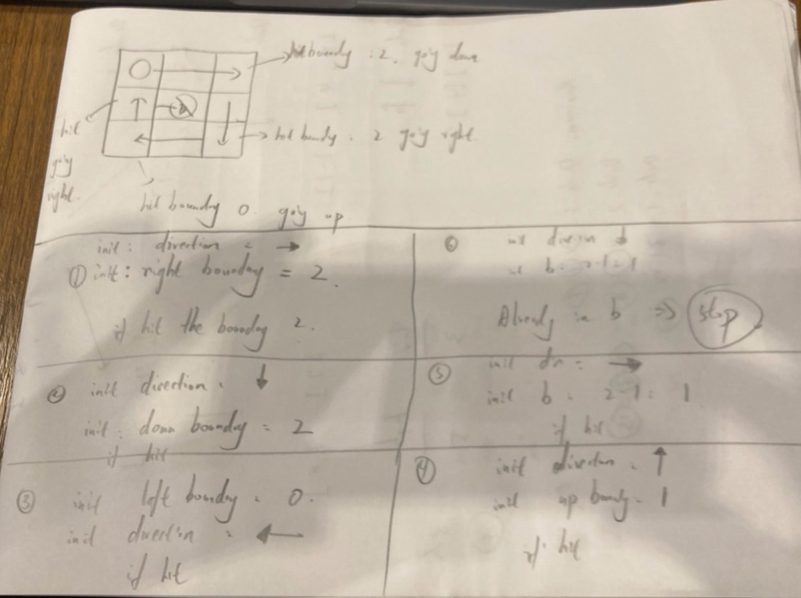

# 54. Spiral Matrix

<br>

link: https://leetcode.com/problems/spiral-matrix/description/

<br>

---

## Topic

* Array
* Matrix
* Simulation

<br>
<br>

## Brain Strom

As the topic said, we can utilize Simulation to solve this prblem, and I draw the blue print:



Setup the boundary first, When we have a 3x3 Matrix, we can init the boundary and direction like:

```
top_boundary = (1, _)
right_boundary = (_, 2)
bottom_boundary = (2, _)
left_boundary = (_, 0) 

current_direction = GODING_LEFT
```

At first, we keep going right until we hit the right boundary `(_, 2)`, then we change our `current_direction` to `GOING_DOWN` and let `right_boundary -= 1`

So now, the state is:

```
top_boundary = (1, _)
right_boundary = (_, 1)
bottom_boundary = (2, _)
left_boundary = (_, 0) 

current_direction = GODING_DOWN
```

We keep going down until we hit the bottom boundary `(2, _)`, change `current_direction` to `GOING_LEFT` and let `bottom_boundary -= 1`


Now the state is:

```
top_boundary = (1, _)
right_boundary = (_, 1)
bottom_boundary = (1, _)
left_boundary = (_, 0) 

current_direction = GODING_LEFT
```

repeat until we hit left boundary, change direct to going up, and the left boundary should plus 1 instead. 
the state is:


```
top_boundary = (1, _)
right_boundary = (_, 1)
bottom_boundary = (1, _)
left_boundary = (_, 1) 

current_direction = GODING_UP
```

keep going up until hit top boundary, we got:

```
top_boundary = (2, _)
right_boundary = (_, 1)
bottom_boundary = (1, _)
left_boundary = (_, 1) 

current_direction = GODING_RIGHT
```

keep going left until we git right boundary, now we should in position (1, 1).

let's change the state again:

```
top_boundary = (2, _)
right_boundary = (_, 0)
bottom_boundary = (1, _)
left_boundary = (_, 1) 

current_direction = GODING_DOWN
```

for now, we're in (1, 1) and also we're already reach the bottom_boundary (1, _). So, that a break point. 

<br>

### Chat-GPT comment on my approach:

* You initialized top = 1, but the first pass must pick up row 0.

* Similarly, right should start at index 2, bottom at 2, and left at 0.

* After going right along row 0, you’d set top = 1 (not initially).

<br>

That off‑by‑one in your example led to missing the first row.

Your boundary‑shrinking loop is by far the simplest, most efficient, and most readable approach for “spiral matrix.” Unless you have a very unusual constraint (e.g. you really need recursion for a teaching example, or you’re in a context that forbids mutating indices), stick with the four‑walls method — it is essentially optimal.

<br>

### Implement

Seems like I'm on the right track. let do it:


```rust
impl Solution {

    pub fn spiral_order(matrix: Vec<Vec<i32>>) -> Vec<i32> {
        if matrix.is_empty() || matrix[0].is_empty() {
            return vec![];
        }

        let mut navigator = MatrixNavigator::new(matrix.len(), matrix[0].len());
        let mut result = Vec::new();

        let mut row = 0;
        let mut col = 0;
        result.push(matrix[row][col].clone());

        for i in 0..matrix.len()*matrix[0].len() - 1 {
            let res = navigator.next(row, col);
            match res {
                Ok((next_row, next_col)) => {
                    row = next_row;
                    col = next_col;
                    result.push(matrix[row][col].clone());
                },
                Err(e) => {
                    break;
                }
            }
        }

        result
    }
}

pub enum Direction {
    Right,
    Down,
    Left,
    Up,
}

pub struct MatrixNavigator {
    direction: Direction,
    top_boundary: (usize, usize),
    bottom_boundary: (usize, usize),
    left_boundary: (usize, usize),
    right_boundary: (usize, usize),
}

impl MatrixNavigator {
    pub fn new(rowLen: usize, colLen: usize) -> Self {
        MatrixNavigator {
             direction: Direction::Right,
            top_boundary: (0, 0), 
            bottom_boundary: (rowLen - 1, colLen - 1), 
            left_boundary: (rowLen - 1, 0), 
            right_boundary: (0, colLen - 1), 
        }
    }

    pub fn next(&mut self, row: usize, col: usize) -> Result<(usize, usize), String> {
        if self.hit_boundary(row, col) {
            self.direction = self.change_direction(row, col)?;
        }

        let next_position = match self.direction {
            Direction::Right => (row, col + 1),
            Direction::Down  => (row + 1, col),
            Direction::Left  => (row, col.saturating_sub(1)),
            Direction::Up    => (row.saturating_sub(1), col),
        };

        Ok(next_position)
    }

    fn change_direction(&mut self, row: usize, col: usize) -> Result<Direction, String> {
        // update current boundaries based on the current direction
        let new_direction = match self.direction {
            Direction::Right => {
                self.top_boundary.0 += 1;
                Direction::Down
            }
            Direction::Down => {
                self.right_boundary.1 -= 1;
                Direction::Left
            }
            Direction::Left => {
                self.bottom_boundary.0 -= 1;
                Direction::Up
            }
            Direction::Up => {
                self.left_boundary.1 += 1;
                Direction::Right
            }
        };

        Ok(new_direction)
    }

    fn hit_boundary(&self, row: usize, col: usize) -> bool {
        match self.direction {
            Direction::Right => col == self.right_boundary.1,
            Direction::Down => row == self.bottom_boundary.0,
            Direction::Left => col == self.left_boundary.1,
            Direction::Up => row == self.top_boundary.0,
        }
    }
}
```
